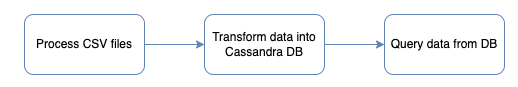

# Data Modeling with Cassandra
## Project Overview
Sparkify, a startup music streaming app, aims to analyze the data collected on songs and user activity within their platform. The analysis team's primary focus is understanding users' listening behavior and preferences. However, the current data storage structure comprises CSV files in a directory, making it difficult to perform efficient queries for generating meaningful insights.

The objective of this project is to create an Apache Cassandra database capable of handling queries on song play data to address specific questions.

## Datasets
The dataset named event_data is stored in the directory event_data, containing CSV files partitioned by date. 

## ETL Pipeline
The project's Extract, Transform, Load (ETL) pipeline consists of three main steps:

### 1. Extract
In this step, I process all CSV files within the event_data directory to create a new CSV file containing relevant information for populating the Apache Cassandra tables.
### 2. Transform
We create an Apache Cassandra database and perform data transformation using the new CSV file generated in the previous step. This involves designing appropriate tables to store the data efficiently.
### 3. Load and Query
Finally, we load the transformed data into the Apache Cassandra tables. The data is now ready for querying, enabling the analysis team to derive valuable insights into user song preferences and behavior.

## Process CSV Files
During this stage, we read and process all CSV files from the event_data directory. The goal is to create a denormalized event data file called event_datafile_new.csv. This file will serve as the data source for inserting relevant information into the Apache Cassandra tables.

Below is a screenshot representing how the denormalized data should appear in the event_datafile_new.csv after processing the CSV files.

By completing this project,it provide Sparkify with a powerful data modeling solution using Apache Cassandra, facilitating efficient querying of song play data and enabling deeper insights into user behavior on their music streaming app.
